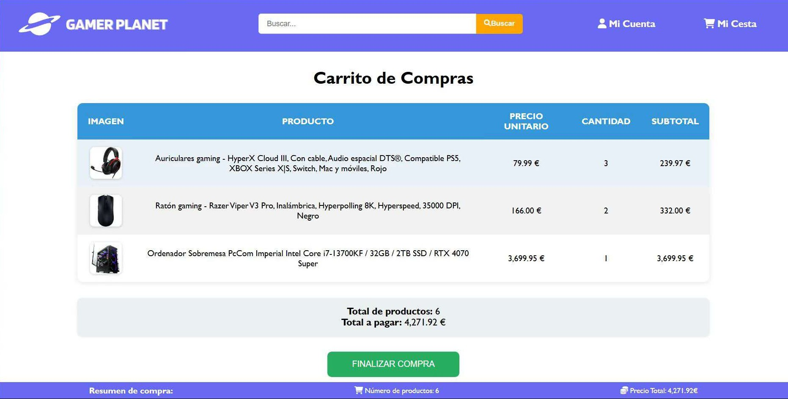

# 🪐Gamer Planet - E-commerce Website

## 🌐 Project Overview

Gamer Planet is a e-commerce website developed as a project for the **Internet and Web Development Technologies (TDIW)** course during the third year of our Computer Engineering degree at Universitat Autonòma de Barcelona. The platform specializes in selling gaming components and accessories.

**Note:** This repository contains the source code for the project, but the live website and database were previously hosted on our school's servers and are no longer accessible. The code is presented here to demonstrate the development work and architecture we implemented.

## 📸 Website Screenshots

### Home Page

### Product Page

### Shopping Cart

### Purchase Completed

## 🛠️ Technologies Used

### Frontend
- **HTML5** - Page structure and content
- **CSS** - Styling and responsive design
- **JavaScript** - Client-side interactivity

### Backend
- **PHP** - Server-side logic and processing
- **PostgreSQL** - Database management

### Architecture
- **MVC Pattern** - Model-View-Controller architecture for separation of concerns
- **Session Management** - User authentication and state persistence

## 👥 Authors

- **David Zheng**
- **Yanhao Lin**
